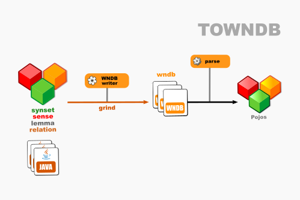

# OEWN model-to-WNDB

This writes a model to WNDB format.

Project [towndb](https://github.com/oewntk/towndb)

## Dataflow

## Maven Central

		<groupId>io.github.oewntk</groupId>
		<artifactId>towndb</artifactId>
		<version>2.1.3</version>
